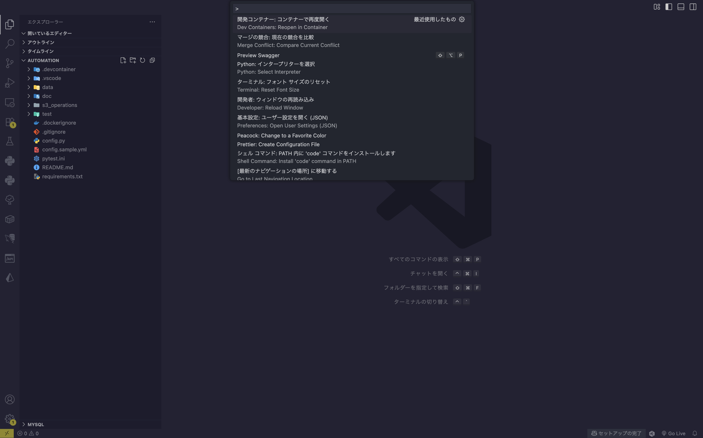

# Automation

Python を使ったタスク自動化ツールです。


---

## 機能

### [S3 Operations](./doc/s3_operations/README.md)
- **UPLOAD**  
  リソースを指定のパスへ一括アップロードします。
- **DELETE**  
  URL を指定してリソースを一括削除します。

### MySQL Operations
- 🚀🚀 **準備中...**

<br>

---

## 環境構成

```
.
|
├── requirements.txt 
|
|
├── .devcontainer/
|    ├── devcontainer.json
|    ├── docker-compose.yml
|    └── Dockerfile
|
|
├── config.py                                              << Load Environment
├── config.yml                                             << Environment
│
|
├── data/                                                  << Input/Output
│   └── s3_operations/
│       ├── files/
│       │   └── resouce_file
│       ├── logs/
│       │   ├── delete_results.txt
│       │   └── upload_results.txt
│       └── params/
│           ├── delete_url_list.txt
│           └── upload_file_list.txt
│
|
└── s3_operations/                                         << Project
    ├── custom_log.py
    ├── delete.py       << Exec Script 
    ├── upload.py       << Exec Script
    └── utils.py

```

<br>

---

## セットアップ手順 

1. リポジトリをローカル環境へコピーし、VS Code を開きます。

    ```bash
    git clone https://github.com/r-miyashita/automation.git && cd automation && rm -rf .git && code .
    ```

<br>

2. `Ctrl + Shift + P` を押してコマンドパレットを開き、  
   「Dev Containers: Reopen in Container（開発コンテナー：コンテナーで再度開く）」を選択します。



<br><br>

