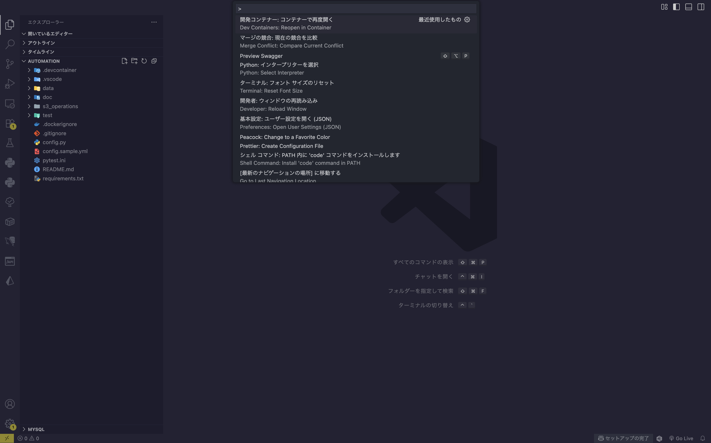

<link rel="stylesheet" href="./md.css">

# Automation

pythonを使ってタスクの自動化を行います。<br>
<br>


<br>

## 機能

-  <span style="display:block;margin-bottom:.375em"><a href="./doc/s3_operations/s3_operations.md" style="color:#af9441;">S3 Operations</a></span>
    - <span style="color:rgba(0, 213, 255, 0.5);font-size:.875em;font-weight:bold;">UPLOAD</a></span>
        <br>
        <span class="text-pale text-nested">
        リソースを指定のパスへ一括アップロードします
        </span>
    - <span style="color:rgba(0, 213, 255, 0.5);font-size:.875em;font-weight:bold;">DELETE</span>
        <br>
        <span style="opacity:.75;font-size:.75em;display:block;text-indent:1em;">
        URL指定でリソースを一括削除します
        </span>

<br>

- <span style="display:block;margin-bottom:.375em">MySQL Operations</span>
    - 🚀🚀 <span style="font-weight:bold;color:rgba(0, 213, 255, 0.5);font-size:.875em;">Getting ready...</span>


<br><br>

## 環境

<br>
<div style="font-size:smaller;">

````
.
|
├── requirements.txt 
|
|
├── .devcontainer/
|    ├── devcontainer.json
|    ├── docker-compose.yml
|    └── Dockerfile
|
|
├── config.py                                              << Load Environment
├── config.yml                                             << Environment
│
|
├── data/                                                  << Input/Output
│   └── s3/
│       ├── files/
│       │   └── resouce_file
│       ├── logs/
│       │   ├── delete_results.txt
│       │   └── upload_results.txt
│       └── params/
│           ├── delete_url_list.txt
│           └── upload_file_list.txt
│
|
└── s3_operations/                                         << Project
    ├── custom_log.py
    ├── delete.py       << Exec Script 
    ├── upload.py       << Exec Script
    └── utils.py


````

</div>

<br><br>

## Getting Start ⚡
<br>

リポジトリをローカル環境へコピーし、VS Codeを開く
<br>

```
git clone https://github.com/r-miyashita/automation.git && cd automation && rm -rf .git && code .
```

<br>

ctr + shift + p を押して、「Dev containers: Reopen in Container（開発コンテナー：コンテナーで再度開く」を選択する



<br>


<br><br><br><br>