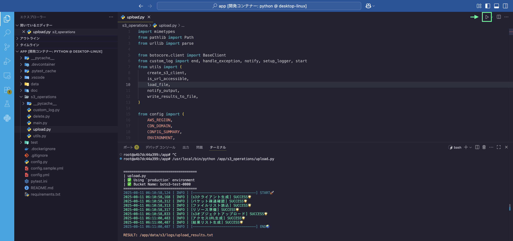
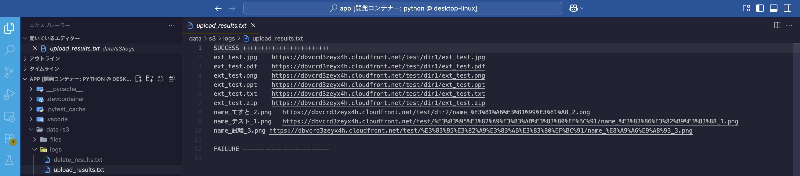
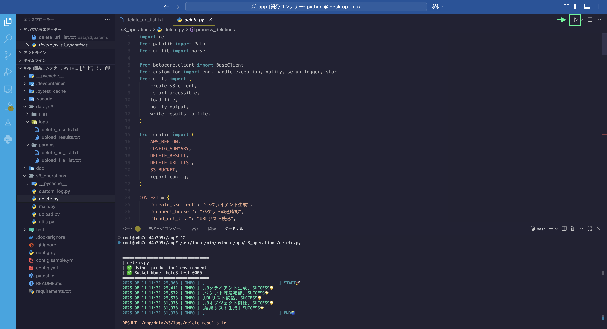
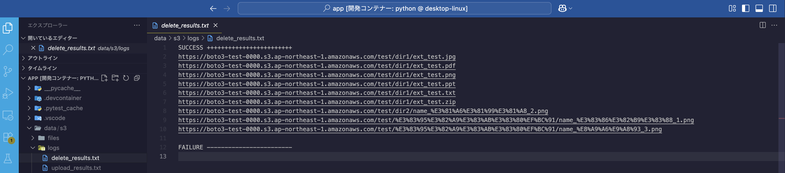

# S3 Operations

AWS S3へのリソースのアップロード・削除を効率化する自動化ツールです。  
AWSコンソールを開かずに、VSCodeなどのローカル環境から一括操作が可能です。

---

#### 👷🏻‍♂️Manual


<br>

#### ⚡️Automated


<br>

---

## 機能概要

- **UPLOAD**  
  - S3へファイルを一括アップロード  
  - アップロードしたS3オブジェクトのURLを取得  
  - CDN用URL（CloudFrontなど）へ変換  
  - URLの疎通確認（アクセス可能かチェック）  

- **DELETE**  
  - 削除対象URLリストからS3オブジェクトキーを抽出  
  - 対応するS3オブジェクトを一括削除

<br>

> [!NOTE]
> - アップロード・削除時の結果は `./data/s3_operations/logs/` に保存されます
> - URLの変換・疎通チェックは `config.yml` の `environment` によって挙動が変わります  
> - 日本語や特殊文字を含むファイル名も適切にURLエンコードして処理されます

<br>

---

## ディレクトリ構成

```
.
|
├── config.py                                              << Load Environment
├── config.yml                                             << Environment
│
|
├── data/                                                  << Input/Output
│   └── s3_operations/
│       ├── files/
│       │   └── resouce_file
│       ├── logs/
│       │   ├── delete_results.txt
│       │   └── upload_results.txt
│       └── params/
│           ├── delete_url_list.txt
│           └── upload_file_list.txt
│
|
└── s3_operations/                                         << Project
    ├── custom_log.py
    ├── delete.py       * Exec Script
    ├── upload.py       * Exec Script
    └── utils.py

```

<br>

---

## 設定ファイルについて

[config.sample.yml](https://github.com/r-miyashita/automation/blob/main/config.sample.yml)をベースに編集し、`config.yml`として保存してください。

### 主な設定項目

|キー|説明|
|-|-|
|`environment`|動作環境を指定 <br> `development` / `production`
|`environments`|各環境ごとのAWS認証情報やバケット名、CDNドメインを設定|
> [!IMPORTANT]
> アップロードに関しては、`environment`の指定により 処理結果(返却URL)が変わります。 <br><br>
> CDNオリジンのURLが必要な場合は 必ず`production`を指定してください。 <br>
> `development`（ S3直URL をそのまま返却 ） <br>
> `production` ( CDN経由URL を返却 )
> 

<br>

### 設定例（抜粋）

```yaml
environment: "development"

environments:
  development:
    aws:
      access_key_id: "YOUR_ACCESS_KEY"
      secret_access_key: "YOUR_SECRET_KEY"
      region: "your-region"
      bucket_name: "your-dev-bucket"

  production:
    aws:
      access_key_id: "YOUR_ACCESS_KEY"
      secret_access_key: "YOUR_SECRET_KEY"
      region: "your-region"
      bucket_name: "your-prod-bucket"

    cdn_origin:
      domain: "your-cloudfront-domain.net"
```

<br>

---

## 使い方

### 1. UPLOAD [( upload.py )](https://github.com/r-miyashita/automation/blob/main/s3_operations/upload.py)


#### 準備

- アップロードしたいファイルを `./data/s3_operations/files` に配置  
- アップロードパスを `upload_file_list.txt` に記入し、`./data/s3_operations/params` に置く

```text
# upload_file_list.txt の例（バケット名は含めず、S3内のパスを記述）

test/dir1/ext_test.jpg
test/dir1/ext_test.pdf
test/dir1/ext_test.png
test/dir1/ext_test.ppt
test/dir1/ext_test.txt
test/dir1/ext_test.zip
test/dir2/name_てすと_2.png
test/フォルダ１/name_テスト_1.png
test/フォルダ１/name_試験_3.png
```

<br>

⚡️VScodeで実行


<br>

👀アップロード結果の確認



<br><br>

### 2. DELETE [( delete.py )](https://github.com/r-miyashita/automation/blob/main/s3_operations/delete.py)

#### 準備

- 削除対象のURLを `delete_url_list.txt` に記入し、`./data/s3_operations/params` に配置します。

```text
# delete_url_list.txt の例

https://dbvcrd3zeyx4h.cloudfront.net/test/dir1/ext_test.jpg
https://dbvcrd3zeyx4h.cloudfront.net/test/dir1/ext_test.pdf
https://dbvcrd3zeyx4h.cloudfront.net/test/dir1/ext_test.png
https://dbvcrd3zeyx4h.cloudfront.net/test/dir1/ext_test.ppt
https://dbvcrd3zeyx4h.cloudfront.net/test/dir1/ext_test.txt
https://dbvcrd3zeyx4h.cloudfront.net/test/dir1/ext_test.zip
https://dbvcrd3zeyx4h.cloudfront.net/test/dir2/name_%E3%81%A6%E3%81%99%E3%81%A8_2.png
https://dbvcrd3zeyx4h.cloudfront.net/test/%E3%83%95%E3%82%A9%E3%83%AB%E3%83%80%EF%BC%91/name_%E3%83%86%E3%82%B9%E3%83%88_1.png
https://dbvcrd3zeyx4h.cloudfront.net/test/%E3%83%95%E3%82%A9%E3%83%AB%E3%83%80%EF%BC%91/name_%E8%A9%A6%E9%A8%93_3.png
```

<br>

⚡️VScodeで実行


<br>

👀削除結果の確認
