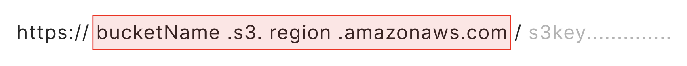

# delete.py

## 概要

💡 S3のファイル削除を自動化します

リストに記載されたパブリックURLを読み取ってオブジェクトを完全削除します


<br><br>
## 機能
<span style="background:PaleGreen"> デリート</span>　パブリックURLからオブジェクトを特定し削除します


<br><br>
## 環境
```
📂automation/
│
├── 📂data/
│   └── 📂s3/
│       │
│       ├── 📄delete_url_list.txt #🔻 input
│       └── 📂logs/
│
├── 📂s3_operations/
│   │
│   ├── delete.py #✅ 削除用の実行スクリプト
│   └── utils.py #共通処理
│
├── config.py
├── config.yml
└── requirements.txt
```

<br><br>
## 手順
1. `delete_url_list.txt`　にアップロード先を記述してください
2. `delete.py`　を実行してください
3. ＞＞＞　📂 logs配下に　`delete_results.txt`　が作成されます🎉🎉


<br><br><br>
----
## `📄delete_url_list.txt`の準備
<br>
`削除対象のURL`　をリストに記載してください

```
📄delete_url_list.txt

https://bucketName.s3.region.amazonaws.com/test/dir1/aaa.png
https://distributionxxxxx.cloudfront.net/test/dir1/bbb.png

```


<br><br><br>
📍リソースへアクセスするためには　<span style="background:LightPink">① s3公開用のパブリックURL</span>　が必要となります<br>
しかし、<span style="background:PaleTurquoise">② CloudFront</span>　経由でコンテンツが配信される場合は URLのドメイン部分が変わります

<br>
どちらもs3リソースへアクセスできる正しいURLです

<br><br><br>
① s3 パブリックURL
 <div></div>
 <br>
 ② CloudFront経由のURL
 <div></div>


<br><br><br>
pythonスクリプトでアクセスする場合　<span style="background:LightPink"> ① </span>　を必要としますが、リストへの記載はどちらでも大丈夫です。

（　処理中にドメイン置換をかけ、<span style="background:LightPink"> ① </span>　の形式にします。リソースへアクセスできる正しいURLであれば問題ないです　）


<br><br><br>
----
#automation/s3_operations