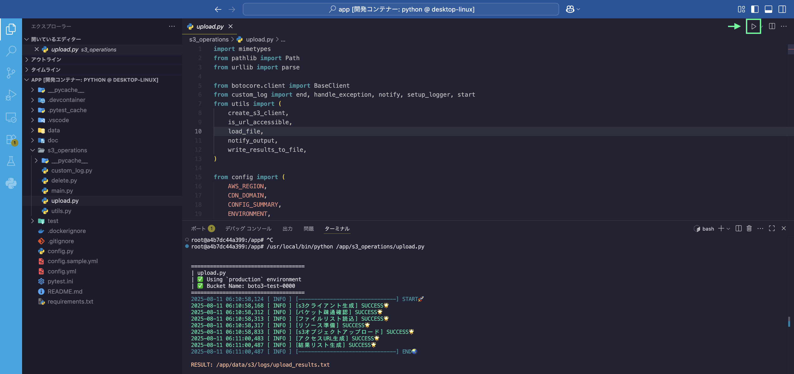
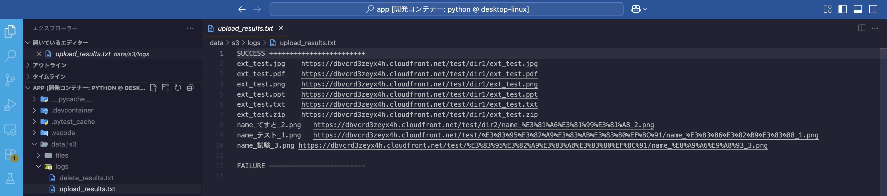
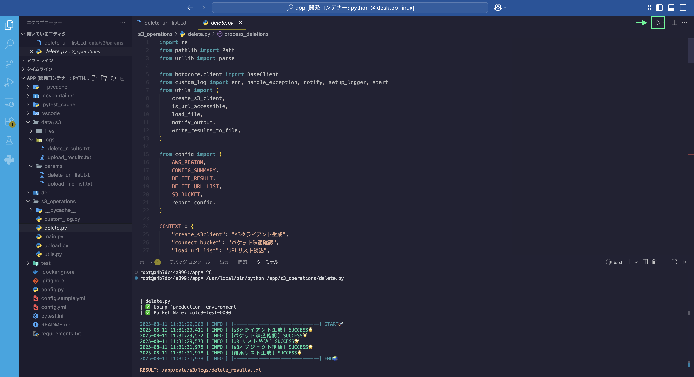
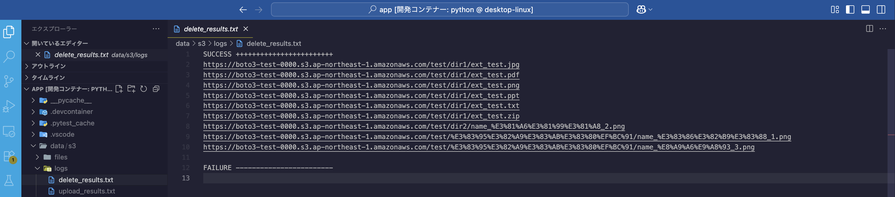

<link rel="stylesheet" href="../../md.css">

# S3 Oparations

AWS S3へのリソース追加・削除作業を効率化します。<br>
コンソール画面を開くことなくVScode上でリソースを一括操作することができます。

<br><br>

<p style="margin-bottom:0.5em"><strong style="color: #F5A623;">Before</strong><span class="text-pale">（手動アップロード）</span></p>
<video src="./s3_manual_upload.mov" style="width: clamp(400px, 70%, 800px);" controls autoplay muted></video>
<br><br>
<p style="margin-bottom:0.5em"><strong style="color:#2ECC71;">After</strong><span class="text-pale">（自動アップロード）</span></p>
<video src="./s3_automation_upload.mov" style="width: clamp(400px, 70%, 800px);" controls autoplay muted></video>


<br><br>

## 機能

 - UPLOAD
    - <span class="text-pale">S3へオブジェクトをアップロードします</span>
    - <span class="text-pale">S3オブジェクトのURLを取得し、CDN用のURLへ変換します</span>
    - <span class="text-pale">URLの疎通チェックを行い、有効なURLを返却します</span>

<br>

 - DELETE
    - <span class="text-pale">URLリストをS3オブジェクトURLへ変換します</span>
    - <span class="text-pale">S3オブジェクトを削除します</span>


<br><br>

## 環境

<br>
<div style="font-size:smaller;">

````
.
|
├── config.py                                              << Load Environment
├── config.yml                                             << Environment
│
|
├── data/                                                  << Input/Output
│   └── s3/
│       ├── files/
│       │   └── resouce_file
│       ├── logs/
│       │   ├── delete_results.txt
│       │   └── upload_results.txt
│       └── params/
│           ├── delete_url_list.txt
│           └── upload_file_list.txt
│
|
└── s3_operations/                                         << Project
    ├── custom_log.py
    ├── delete.py       * Exec Script
    ├── upload.py       * Exec Script
    └── utils.py


````

</div>

<br><br>

## 設定

#### <span style="font-size:.875em;">[🔗 config.yml](https://github.com/r-miyashita/automation/blob/main/config.sample.yml)</span>

<span class="text-nested">[ ./config.sample.yml ] を編集し、[ config.yml ]として保存してください。</span>

<br>

- environment
    - <span style="font-size:.875em">動作環境を指定してください</span>
        <br><span class="text-pale text-nested">
        development ... アップロード時に生成するURLに対しオリジンの変換を行いません（S3オリジンのまま）。
        </span>
        <span class="text-pale text-nested" style="margin-bottom:0;">
        production ... アップロード時に生成するURLのオリジンを指定のものへ変換します。
        </span>

<br>

- environments
    - <span style="font-size:.875em">動作環境を設定してください。</span>
        <br><span class="text-pale text-nested">
        aws ... アクセスキーとバケット情報を設定してください。
        </span>
        <span class="text-pale text-nested">
        cdn_origin ... アクセスURLを指定のオリジンに変換します。例えば、cloudFrontを経由してリソースを提供したい場合に設定します。
        </span>

> [!TIP]
> Optional information to help a user be more successful.

<div class="ml-s">

```
# config.sample.yml ( 該当部分 )

# 設定ファイルに読み込ませる環境を指定
environment: "development"

environments:
  development:
    aws:
      access_key_id: "access_key_id"
      secret_access_key: "secret_access_key"
      region: "region"
      bucket_name: "backet_name"

  production:
    aws:
      access_key_id: "access_key_id"
      secret_access_key: "secret_access_key"
      region: "region"
      bucket_name: "bucket_name"

    cdn_origin:
      domain: "xxx.net"

```

</div>

<br><br>

## 使い方

#### <span style="font-size:1.125em;">[🔗 upload.py](https://github.com/r-miyashita/automation/blob/main/s3_operations/upload.py)</span>

<span class="text-nested">アップロードしたいリソースとパス情報を準備し、スクリプトを実行します。</span>

<br>

1. <span style="font-size:1.25em;display:block;margin-bottom:-1em;">事前準備</span>
    - <span style="font-size:.875em">リソースの配置</span>
    <br><span class="text-pale text-nested">
    S3へアップロードするリソースを[ ./data/s3/files ]へ格納してください。
    </span>
    - <span style="font-size:.875em">パラメータファイルの配置</span>
    <br><span class="text-pale text-nested">
    アップロード先を[ upload_file_list.txt ]へ記入し[ ./data/s3/param ]へ格納してください。
    </span>

    <div class="pl-s" style="margin:1em 0; font-weight:100;">

    ```
    # upload_file_list.txt ( バケット名は含めない。以降のディレクトリ階層を指定する。 )

    test/dir1/ext_test.jpg
    test/dir1/ext_test.pdf
    test/dir1/ext_test.png
    test/dir1/ext_test.ppt
    test/dir1/ext_test.txt
    test/dir1/ext_test.zip
    test/dir2/name_てすと_2.png
    test/フォルダ１/name_テスト_1.png
    test/フォルダ１/name_試験_3.png
    ```

    </div>

<br><br>

2. <span style="font-size:.95em;">スクリプト実行</span>
    - <span style="font-size:.875em">[ ./s3_operations/upload.py ]を実行</span>
    

<br><br>

3. <span style="font-size:.95em;">結果ファイルの確認</span>
    - <span style="font-size:.875em">[ ./data/s3/logs/upload_results.txt ]を確認</span>
        <br><span class="text-pale text-nested">
        CloudFrontドメインへ置換されたURLのリストが返却されています。
        </span>
    


<br><br><br>

<hr style="height:0.5px;">

#### <span style="font-size:1.125em;">[🔗 delete.py](https://github.com/r-miyashita/automation/blob/main/s3_operations/delete.py)</span>

<span class="text-nested">削除したいURL情報を準備し、スクリプトを実行します。</span>

<br>

1. <span style="font-size:1.25em;display:block;margin-bottom:-1em;">事前準備</span>
    - <span style="font-size:.875em">パラメータファイルの配置</span>
    <br><span class="text-pale text-nested">
    削除対象のURLを[ delete_url_list.txt ]へ記入し[ ./data/s3/param ]へ格納してください。
    </span>

    <div class="pl-s" style="margin:1em 0; font-weight:100;">

    ```
    # delete_url_list.txt

    https://dbvcrd3zeyx4h.cloudfront.net/test/dir1/ext_test.jpg
    https://dbvcrd3zeyx4h.cloudfront.net/test/dir1/ext_test.pdf
    https://dbvcrd3zeyx4h.cloudfront.net/test/dir1/ext_test.png
    https://dbvcrd3zeyx4h.cloudfront.net/test/dir1/ext_test.ppt
    https://dbvcrd3zeyx4h.cloudfront.net/test/dir1/ext_test.txt
    https://dbvcrd3zeyx4h.cloudfront.net/test/dir1/ext_test.zip
    https://dbvcrd3zeyx4h.cloudfront.net/test/dir2/name_%E3%81%A6%E3%81%99%E3%81%A8_2.png
    https://dbvcrd3zeyx4h.cloudfront.net/test/%E3%83%95%E3%82%A9%E3%83%AB%E3%83%80%EF%BC%91/name_%E3%83%86%E3%82%B9%E3%83%88_1.png
    https://dbvcrd3zeyx4h.cloudfront.net/test/%E3%83%95%E3%82%A9%E3%83%AB%E3%83%80%EF%BC%91/name_%E8%A9%A6%E9%A8%93_3.png
    ```

    </div>

<br><br>

2. <span style="font-size:.95em;">スクリプト実行</span>
    - <span style="font-size:.875em">[ ./s3_operations/delete.py ]を実行</span>
    

<br><br>

3. <span style="font-size:.95em;">結果ファイルの確認</span>
    - <span style="font-size:.875em">[ ./data/s3/logs/delete_results.txt ]を確認</span>
        <br><span class="text-pale text-nested">
        削除したURLのリストが返却されます。
        </span>
    


<br><br><br><br>
<br><br><br><br>

